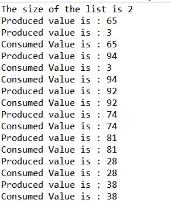

<h1> Assignment 4 : Multithreading in JAVA  
<h3> Task : Implementaion of producer-consumer problem using locks </h3>

  <style ="font-family : Times New Roman" ;"font-size=36px"> The Sample output for the program is attached below :-  
    
